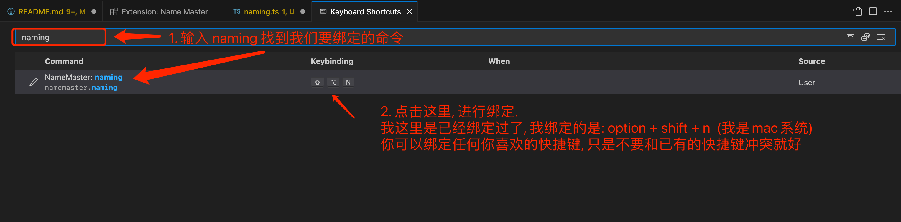

# Name Master | 命名大师

用 GPT 给程序命名

你可以用中文(拼音也可以), 描述你要命名的变量/函数/类, 插件会根据你的描述为你提供多个名字供你选择

效果展示:

给函数命名

使用拼音命名

给 class 命名

## 如何使用

1. 安装插件

   在插件市场搜索: Name Master, 点击安装.

   或者你可以点击链接查看插件 👉 [插件链接](https://marketplace.visualstudio.com/items?itemName=dowithless.namemaster)

   

2. 获取 key

   打开 [namemaster.org](https://www.namemaster.org/) 授权登录后获取 key

   

   复制 key

3. 设置 key

   在 vs code 中, 使用快捷键调出命令面板:

   mac 用户: cmd + shift + p

   windows 用户: ctrl + shift + p

   输入: set key

   然后根据提示, 将复制的 key 粘贴到输入框中, 然后回车确认

   

   

4. 开始使用

   在编辑器中打开一个 js/ts 文件, 键入内容: `const 用户等级` , 然后使用快捷键调出命令面板:

   mac 用户: cmd + shift + p

   windows 用户: ctrl + shift + p

   输入: naming , 然后在匹配到的命令中选择: NameMaster: naming

   完成 🎉

   

   

5. 设置快捷键

   在上面的使用中, 每次使用命名功能, 需要先调出命令面板再输入 naming 命令, 比较繁琐, 我们可以给 naming 命令设置一个快捷键, 这样就可以直接通过快捷键使命名功能了.

   设置方式: 调出命令面板: cmd + shift + p 或者 ctrl + shift + p

   输入: keyboard, 然后选择: Open Keyboard Shortcuts (我的 vscode 语言是英文, 如果你使用的是中文版本, 英文搜不到的话输入中文试一下.)

   

   

   设置完成后, 就可以直接使用快捷键调用命名命令了.

## Release Notes

mvp 内测中: 5w 的 token 额度(约可使用 150 次)

> 目前仅针对 js/ts 语言进行了测试, 其它语言使用效果不详, 自行尝试  
> 底层使用的 OpenAI, 即便相同的文本描述,提供的命名结果也会不同  
> 如果当次提供的名称不满意, 可以重复执行命名命令, 直到满意为止  
> 为了节约单次使用成本, 也为了避免选择困难, 每次最多提供 5 个名称以供选择

如何付费使用?

暂定方案: ¥10/50w token (约可使用 1500 次, 单次使用成本大概半分钱), 人工充值(单次充值最少 10 块哈)
没有有效期, 有 token 就可以用, 充多少用多少!

需要的加我微信(备注: name master), 欢迎交流!

Email: neo.dowithless@gmail.com

---

**计算机科学的两大难题之一: 命名, 就这样被攻破了! 👏**

**拥抱 AI 🤖 ️**
